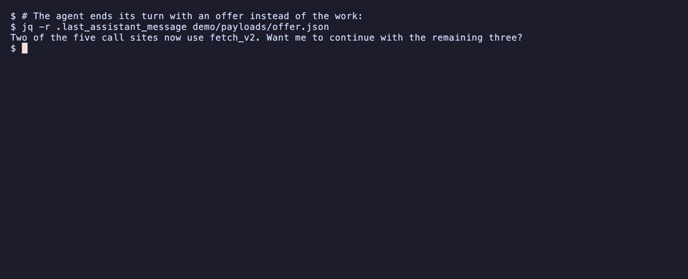

<h1 align="center">
   
  Cliffhanger
</h1>

  <strong>A Claude Code Stop hook and skill that keeps agents working until every part of the task is done or a real blocker is named, and counts every early stop it catches.</strong>

  
  
  

  <a href="#quickstart">⚡ Quickstart</a> •
  <a href="#how-it-works">🔍 How it works</a> •
  <a href="#examples">📖 Examples</a> •
  <a href="#faq">💬 FAQ</a>

> [!TIP]
> Try the hook from the repository root without installing anything:
> ~~~sh
> CLIFFHANGER_HOME="$(mktemp -d)" python3 hooks/cliffhanger.py < demo/payloads/offer.json
> ~~~

  

## Why Cliffhanger

Opus 5.5 and Sonnet 5.5 report progress as they work, and some progress messages end the turn. Anthropic's [prompting guide](https://platform.claude.com/docs/en/build-with-claude/prompt-engineering/prompting-claude-opus-5-5#unattended-agentic-runs) describes four ways this can happen. In an interactive session, someone can type "continue"; in a headless run or overnight job, nobody is there to do it. The report can end with "Want me to continue with the remaining three?" or "Once you approve it, I'll run `python -m pytest -q`."

In a 12-task Sonnet 5.5 benchmark with `Bash(pytest *)` as the only test permission, 6 baseline runs stopped before a green test run. With Cliffhanger's blocking hook and skill, none did, at about 4 percent more cost. In observe mode, the detector flagged those same 6 final messages and none of the other 42 messages.

Every early stop in that benchmark followed a refused command: the allowlist said `pytest *`, the agent tried `python -m pytest`, got refused, and wrapped up. With every test command allowed, neither arm stopped early, and the hook plus skill added about 13 percent to the bill. Cliffhanger guards against early stops and counts how often they happen. It does not fix a model that quits at random.

<b>Benchmark scope</b>

The benchmark used 12 tasks with 4 to 6 parts each: code, tests, docs, a changelog entry, and a request to run pytest and confirm the suite passes. The fixture was a small WSGI app. It ran with `claude -p`, Claude Code 2.1.284, `claude-sonnet-5-5`, `--allowedTools "Read,Edit,Write,Bash(pytest *)"`, one run per task and arm, on 2026-09-30 using a MacBook Air M5.

The baseline used the same hook in observe mode with no skill. The treatment used the blocking hook and `SKILL.md` through `--append-system-prompt-file`. The advice for handling a refused command was added after the same failure appeared in earlier runs, so this was not a held-out test. See [bench/results.md](bench/results.md) for raw tables, command lines, and the discarded run.

The regex bank alone, applied to the first final message from all 48 runs across both allowlists and both arms, flagged exactly the six messages where tests were skipped and none of the other 42. The sample was one model on one fixture. See [docs/method.md](docs/method.md#the-detector-on-real-final-messages) for the method.

## Features

- 🔎 **Reads task checklists:** Uses `TaskCreate` and `TaskUpdate`, the latest `TodoWrite` list, or the latest Markdown `- [ ]` list in the turn.
- 🛑 **Checks both stop events:** Runs on Claude Code's `Stop` and `SubagentStop` events.
- 🧭 **Allows clear escape paths:** A `BLOCKED:` or `NEEDS-YOU:` line, active background work, plan mode, or the continuation cap lets the stop through.
- 🧩 **Catches early-stop patterns:** Uses the four patterns in Anthropic's guide plus a pattern for reports that work was not tested, only when no checklist exists.
- 📊 **Counts decisions:** `cliffhanger stats` reports caught stops and allowed stops by reason, with time-window and JSON options.
- 🧰 **Runs locally:** The hook uses only the Python standard library, makes no model calls, and fails open if it hits an internal error.
- 📄 **Includes instructions for other agents:** `AGENTS.md` gives Codex, Cursor, and OpenCode the same guidance, but nothing enforces it there yet.

## Quickstart

Install as a Claude Code plugin:

~~~sh
claude plugin marketplace add Arthur031221/cliffhanger && claude plugin install cliffhanger@cliffhanger
~~~

This installs the hook, the skill, and the `/cliffhanger:stats` command. The plugin metadata reports version `0.1.0`. Other install options:

| You want | Run |
|---|---|
| The skill only, for any agent that reads Agent Skills | `npx skills add Arthur031221/cliffhanger -g` |
| The hook in `~/.claude/settings.json`, without the plugin | `git clone https://github.com/Arthur031221/cliffhanger && cliffhanger/bin/cliffhanger install` |
| One session from a clone | `claude --plugin-dir ./cliffhanger` |
| Codex, Cursor, or OpenCode without a hook | Copy [AGENTS.md](AGENTS.md) into your project |

Python 3.8 or newer must be on `PATH` as `python3`. There are no other dependencies.

Clone the repository first if you need a local copy: `git clone https://github.com/Arthur031221/cliffhanger && cd cliffhanger`.

From the repository root, the hook can decide on a message without starting an agent:

~~~sh
export CLIFFHANGER_HOME="$(mktemp -d)"
echo '{"session_id":"try","last_assistant_message":"Two of five call sites migrated. Want me to continue with the rest?"}' | python3 hooks/cliffhanger.py
bin/cliffhanger stats
~~~

The hook prints the real decision below. `bin/cliffhanger stats` prints stats from the isolated log.

~~~text
{"decision": "block", "reason": "Your last message ended the turn with an offer to carry on that waits for an answer nobody will give (\"Want me to\"). If work the user asked for is still owed, do it now instead of describing or offering it. If everything asked for is done, end with the final report and no offer. If something only the user can clear is in the way, write BLOCKED: <what> <what you need> on its own line."}
caught 1 early stop this week in 1 of 1 sessions
     1  offered to continue
~~~

<b>Use the skill in a headless run</b>

For unattended runs, put the skill in the system prompt from the first request, where the guide says this instruction belongs. In one run with the plugin loaded, the model did not invoke the skill on its own for a two-part task:

~~~sh
claude -p "Migrate the five fetch() call sites to fetch_v2, update their tests, run pytest" \
  --append-system-prompt-file cliffhanger/SKILL.md --permission-mode acceptEdits
~~~

## Examples

The demo payloads include these three cases, and the hook was run against each:

| Case | Input | Result |
|---|---|---|
| An offer to continue | [offer.json](demo/payloads/offer.json) | Blocked with `offers-to-continue`; the hook returns a JSON decision. |
| A real blocker | [blocked.json](demo/payloads/blocked.json) | Allowed; the hook prints no feedback and logs `{"action": "allow", "rule": "blocker-token"}`. |
| A finished checklist | [done.json](demo/payloads/done.json) | Allowed; the hook prints no feedback and logs `{"action": "allow", "rule": "checklist-done"}`. |

The offer case returns:

~~~json
{"decision": "block", "reason": "Your last message ended the turn with an offer to carry on that waits for an answer nobody will give (\"Want me to\"). If work the user asked for is still owed, do it now instead of describing or offering it. If everything asked for is done, end with the final report and no offer. If something only the user can clear is in the way, write BLOCKED: <what> <what you need> on its own line."}
~~~

## How it works

For every `Stop` and `SubagentStop` event, Claude Code sends the hook a JSON payload. The hook reads `last_assistant_message`, `transcript_path`, `stop_hook_active`, and `background_tasks`. It rebuilds a checklist first; only when there is no checklist does it use the early-stop pattern matcher. Every decision is logged to `~/.cliffhanger/log.jsonl`.

<b>Decision order</b>

The first matching rule decides what happens:

| Order | Condition | Decision |
|---|---|---|
| 1 | The message contains `BLOCKED:` or `NEEDS-YOU:` | Allow |
| 2 | Background tasks are still running and will wake the session when done | Allow |
| 3 | Permission mode is `plan` | Allow |
| 4 | This user turn already had 3 automatic continuations (`CLIFFHANGER_MAX`) | Allow |
| 5 | The agent's checklist has open items | Block with `Open items: ... Continue with them.` |
| 6 | A checklist exists and every item is done | Allow |
| 7 | No checklist, and the message names a blocker such as "cannot proceed without" or "credentials" | Allow |
| 8 | No checklist, and the message matches an early-stop pattern | Block and name the pattern |
| 9 | Anything else | Allow |

<b>Checklist and transcript handling</b>

The checklist comes from the transcript: `TaskCreate` and `TaskUpdate` calls, the latest `TodoWrite` list, or the latest Markdown `- [ ]` list the agent wrote in the current user turn. The Markdown fallback matters because Opus 5.5 and Sonnet 5.5 ship without todo tools by default.

Claude Code writes the transcript asynchronously. Before deciding, the hook waits up to 1.5 seconds for `last_assistant_message` to reach the file. Without that wait, an item ticked in the final message could still look open.

When a checklist exists it takes priority over regexes. For example, "All done. Want me to also add CI?" is allowed after a finished checklist, so the hook does not add scope.

<b>Early-stop patterns</b>

The regex bank is a fallback for messages with no checklist. It covers the four patterns in Anthropic's guide and one pattern from the project's own runs: a report that work was not tested.

| Rule | Pattern in plain words | What the agent should do |
|---|---|---|
| `announces-next-step` | Summarizes completed work and promises a later step without taking it | Put the status note and next tool call together |
| `offers-to-continue` | Offers to continue and waits for an answer | Continue with the requested work |
| `decisions-for-user` | Lists choices for the user when none blocks the remaining work | Make each call and explain why, then continue |
| `good-place-to-report` | Stops at a milestone because it feels like a suitable place to report | Continue unless the work is done or blocked |
| `leaves-work-unverified` | Says the requested work was not run or tested | Run it, or write a `BLOCKED:` line explaining why |

The skill is the other half. The hook can send the agent back to work; the skill tells it what done means, to keep a readable checklist, to put status notes in the same message as the next tool call, and how to write a blocker. [docs/method.md](docs/method.md) has the full detector, end-to-end transcripts, and benchmark method.

<b>Counter, failure behavior, and log details</b>

The counter resets when `stop_hook_active` is false, which Claude Code uses to mark a fresh user turn. Claude Code's own cap of 8 consecutive blocks (`CLAUDE_CODE_STOP_HOOK_BLOCK_CAP`) stays behind it.

The hook never calls a model and uses only the standard library. It allows the stop on any internal error, logged to `~/.cliffhanger/errors.log`.

## Stats

<b>Output and options</b>

From a clone, run these through `bin/cliffhanger`, or add `bin/` to `PATH` to use the shorter command name below.

~~~sh
cliffhanger stats
cliffhanger stats --days 30
cliffhanger stats --json
/cliffhanger:stats
~~~

`--days 30` widens the reporting window, and `--json` prints machine-readable numbers. Inside Claude Code, `/cliffhanger:stats` runs the same stats command.

A run of the demo produces:

~~~text
caught 2 early stops this week in 2 of 4 sessions
     1  offered to continue
     1  ended with the work untested
allowed 2 stops
     1  BLOCKED: or NEEDS-YOU: named
     1  checklist complete
~~~

<b>CLI commands</b>

| Command | What it does |
|---|---|
| `cliffhanger stats [--days N] [--json]` | Early stops caught, by pattern, and stops allowed, by reason. Default window 7 days. |
| `cliffhanger status [--settings PATH] [--json]` | On or off, installed in which events, mode, cap, log path. |
| `cliffhanger off` / `cliffhanger on` | Pause or resume the hook everywhere by creating or removing `~/.cliffhanger/off`. |
| `cliffhanger install [--settings PATH] [--no-subagent] [--dry-run] [--json]` | Add Stop and SubagentStop handlers to `~/.claude/settings.json`. Backs up the file first, keeps existing hooks, follows a symlinked settings file, writes atomically, and is idempotent. |
| `cliffhanger uninstall [--settings PATH] [--dry-run] [--json]` | Remove only handlers that point at `cliffhanger.py`, with a backup. |

Every command takes `--help`.

<b>Environment and files</b>

| Variable | Default | Effect |
|---|---|---|
| `CLIFFHANGER_MAX` | `3` | Automatic continuations per user turn before the hook lets the stop through. The guide suggests two or three. |
| `CLIFFHANGER_OBSERVE` | unset | `1` logs what would be blocked and never blocks. Use it to measure your own sessions first. |
| `CLIFFHANGER_DISABLE` | unset | `1` skips the hook for that process tree. |
| `CLIFFHANGER_SYNC_MS` | `1500` | Longest wait for the transcript to catch up with the final message. |
| `CLIFFHANGER_HOME` | `~/.cliffhanger` | Log, state, and off-switch location. |

- `~/.cliffhanger/log.jsonl`: one line per decision with `ts`, `session`, `event`, `agent`, `action`, `observe`, `rule`, `open` (open item texts), `match` (the matching phrase), `source` (`tasks`, `todo`, `markdown`, or null), `continuation`, and `cwd`. No message text beyond those fields is written.
- `~/.cliffhanger/state/`: per-session continuation counters and short-lived dedupe locks.
- `~/.cliffhanger/errors.log`: exceptions the hook swallowed while failing open.

<b>Hook feedback</b>

With open items, Claude Code receives a message like this:

~~~text
Open items: test in tests/test_api.py; CHANGELOG.md line under Unreleased. Continue with them. If one is blocked, say what is blocking it on a line that starts with BLOCKED:.
~~~

With a pattern match, the reason names the pattern, quotes the matching phrase, and gives the same way out: do the work, end with a plain final report if everything is done, or write a `BLOCKED:` line.

<b>The four cliffhangers</b>

Anthropic's [Prompting Claude Opus 5.5](https://platform.claude.com/docs/en/build-with-claude/prompt-engineering/prompting-claude-opus-5-5#unattended-agentic-runs) names four ways a model can stop while work is still owed. Cliffhanger logs a rule for each:

| Pattern | Rule | Better next action |
|---|---|---|
| A long progress summary ends by announcing the next step without taking it | `announces-next-step` | Put the status note and next tool call in one message |
| An offer to keep going waits for a reply | `offers-to-continue` | Do the remaining work |
| A list of user choices blocks no other work | `decisions-for-user` | Make each call, say why, then continue |
| A milestone becomes a reason to stop and report | `good-place-to-report` | Continue working |

The project adds one rule for a report that work was never run or tested: `leaves-work-unverified`.

<b>Comparison with alternatives</b>

| Tool | What it does | Where Cliffhanger differs |
|---|---|---|
| **Cliffhanger** | Stop and SubagentStop hook; reads TaskCreate/TaskUpdate, TodoWrite, and Markdown `- [ ]` checklists; `BLOCKED:` / `NEEDS-YOU:` escape; cap of 3 per user turn; ships `SKILL.md` and `AGENTS.md`; benchmark in [bench/results.md](bench/results.md); 0 model calls. | Reads the existing checklist before patterns and includes a pattern for untested work. |
| [`/goal`](https://code.claude.com/docs/en/goal) (built in) | Prompt-based Stop hook; a small model judges a condition you write; no checklist; evaluator can rule the goal impossible; stops after several turns with no tool use; no shipped instructions or published measurement; 1 model call (Haiku by default). | It is per session and you type it each time. |
| [claude-nonstop](https://github.com/garetneda-gif/claude-nonstop) | Two Stop hooks; reads TaskCreate/TaskUpdate/TodoWrite; `STATUS: DONE` report and deactivate file; cap 20 by default with an opt-in guard; no shipped instructions; no measurement found; 0 model calls. | Its scripts, checked 2026-09-30, read only task tools and do not wait for the transcript. Cliffhanger also reads Markdown checklists and waits for the transcript to catch up. |
| [no-cliffhanger](https://github.com/waitdeadai/no-cliffhanger) | Stop and SubagentStop hook using bash and jq; reads only the last 320 message characters, not a checklist; `Status: blocked` endings and explicit yes/no questions; no cap stated in its README; no shipped instructions; no measurement found; 0 model calls. | Reads the task checklist and supports explicit `BLOCKED:` / `NEEDS-YOU:` lines. |
| [ralph-claude-code](https://github.com/frankbria/ralph-claude-code) and other Ralph loops | Outer loop restarts `claude`; reads `.ralph/fix_plan.md`; uses an `EXIT_SIGNAL`; rate limit and circuit breaker; ships `.ralph/PROMPT.md`; no measurement found; starts a new session per loop. | Reuses the current in-session context instead of restarting the session. |

`/goal` is the right tool when you can state the end condition, such as all tests in test/auth pass. It is per session and you type it each time. Cliffhanger is always on, costs no model calls, and reads the checklist the agent already keeps. claude-nonstop is the closest design and reads the same task tools. Its scripts, checked 2026-09-30, read only the task tools, so they see no checklist on a 5.5 model without todo tools and read the transcript without waiting for it to catch up. Ralph loops restart whole sessions, which is heavier and loses in-session context.

## FAQ

<b>Does the hook make the model finish?</b>

Not by itself. In the benchmark the skill did the work and the hook never had to block. In one end-to-end run without the skill, the agent returned, tried another test command, got refused again, and ended with a proper `BLOCKED:` line. It never found the allowed `pytest`. The hook turned a vague stop into a clear one, which is useful in an unattended run, but it is not the same as finishing.

<b>Is it worth it on every task?</b>

With every command it needed allowed, Sonnet 5.5 finished all 12 benchmark tasks either way, and the skill added about 13 percent to cost. Run `CLIFFHANGER_OBSERVE=1` for a week, then read `cliffhanger stats` before turning blocking on.

<b>What about interactive sessions?</b>

The guide says to leave this kind of instruction out when someone is there to answer. The hook still helps with open checklist items. If it gets in your way, `cliffhanger off` pauses it, and `CLIFFHANGER_OBSERVE=1` keeps the log without blocking.

<b>What does "Stop hook error occurred" mean?</b>

Claude Code labels every `decision: "block"` from a Stop hook that way in the transcript. It is the label, not a failure. Real failures go to `~/.cliffhanger/errors.log`.

<b>Does the pattern matcher support every language?</b>

The regex bank matches English and Traditional Chinese phrasing. The checklist path works in any language.

<b>How does `AGENTS.md` work in a monorepo?</b>

Claude Code loaded this repository's `AGENTS.md` into a session running in a subdirectory. If you copy it into a monorepo, every session below it gets those instructions.

<b>What about Codex, Cursor, and OpenCode?</b>

They get `AGENTS.md`, which contains instructions only. Nothing enforces them there yet.

<b>What does the hook store?</b>

The hook reads the transcript locally and writes only the fields listed in the Environment and files detail above. It makes no network calls.

## Related projects

- [shiftgear](https://github.com/Arthur031221/shiftgear): Picks the model and effort level before the agent starts. Cliffhanger checks whether the agent finished with it. Both are Claude Code skills.
- [agentleaks](https://github.com/Arthur031221/agentleaks): Another unattended-safe tool, worth pairing with Cliffhanger if agentleaks fix runs as part of a longer job.
- [installwall](https://github.com/Arthur031221/installwall): Guards an install an agent might run mid-task. Cliffhanger guards against the agent quitting before the task is done.

## Contributing

See [CONTRIBUTING.md](CONTRIBUTING.md) and [open an issue](https://github.com/Arthur031221/Cliffhanger/issues). New patterns need a real transcript excerpt that must block and a real final report that must still pass.

## License

MIT. See [LICENSE](LICENSE).

Assisted by Claude/Codex.
